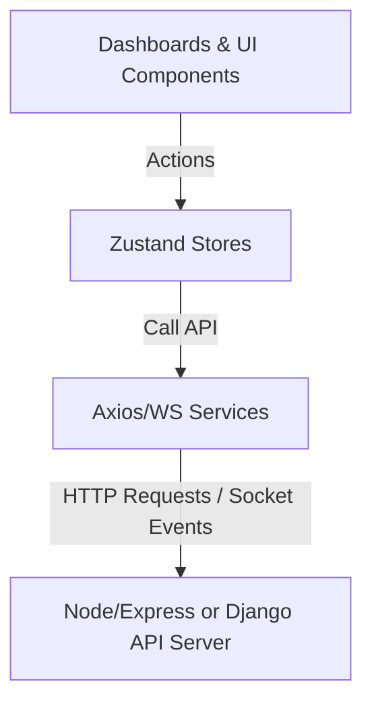

# ProPeak Platform: Backend API Integration & Deployability Guide

This document coordinates the frontend-backend integration for ProPeak. Since the backend development is being handled by another team member, this guide identifies **all hardcoded fillers** currently in the frontend, maps client-side state managers (Zustand) to API services, provides a **technical questionnaire** for alignment, and lists the requirements for a clean deployment.

---

## 1. Environment Variable Setup

The frontend utilizes **Vite** as its build tool. All environment variables must be prefixed with `VITE_` to be exposed to the client-side bundle.

A template file has been placed in the root directory: [.env.example](file:///e:/ProPeak%20Frontend/Frontend/.env.example).

| Variable Name | Purpose | Example (Local Dev) | Example (Production) |
| :--- | :--- | :--- | :--- |
| `VITE_API_URL` | Base endpoint for Axios REST API calls | `http://localhost:5000/api/v1` | `https://api.propeak.dev/api/v1` |
| `VITE_WEBSOCKET_URL` | Server URL for WebSockets (Socket.io) | `http://localhost:5000` | `https://api.propeak.dev` |

### Accessing Env Vars in Code
In the frontend services, use `import.meta.env.VITE_API_URL` to hook up endpoints:
```typescript
const API = axios.create({
  baseURL: import.meta.env.VITE_API_URL || '/api/v1',
  headers: {
    'Content-Type': 'application/json',
  },
})
```

---

## 2. Inventory of Mocks & Fillers (Database Replacements)

The following components and stores contain hardcoded mock data. These need to be replaced with backend API query responses.

### A. Authentication & User Profiles
* **File Location**: [authStore.ts](file:///e:/ProPeak%20Frontend/Frontend/src/stores/authStore.ts#L27-L54)
* **Filler Details**:
  - `mockProfiles`: Hardcoded profiles for `CLIENT` (Sarah Jenkins), `EMPLOYEE` (Ashok Kumar), and `ADMIN` (ProPeak Admin Team).
  - `login` and `signup` methods write simulated JWT tokens and transition states immediately with `setTimeout` delays.

### B. Project Management
* **File Location**: [projectStore.ts](file:///e:/ProPeak%20Frontend/Frontend/src/stores/projectStore.ts#L31-L123)
* **Filler Details**:
  - `mockProjects`: Contains 5 sample contracts (representing available, applied, assigned, and completed states) with predefined title, budget, deadline, skills array, experience level, and detailed milestones array.
  - State manipulation (e.g. `addProject`, `applyForProject`, `submitMilestone`, `approveMilestone`) is handled in-memory and does not persist to database servers.

### C. Chat & Conversations
* **File Location**: [chatStore.ts](file:///e:/ProPeak%20Frontend/Frontend/src/stores/chatStore.ts#L40-L86)
* **Filler Details**:
  - `mockConversations`: Hardcoded direct messages between the student (Ashok Kumar), client (Sarah Jenkins), and the admin team.
  - `sendMessage` method uses `setTimeout` to trigger mock replies from the client after 4 seconds to test UI indicators.

### D. Notifications History
* **File Location**: [notificationStore.ts](file:///e:/ProPeak%20Frontend/Frontend/src/stores/notificationStore.ts#L22-L68)
* **Filler Details**:
  - `initialNotifications`: 5 mock system logs (representing project matches, proposal acceptances, payments deposited, chat alerts, and assignments).

### E. Financial Ledger Transactions
* **File Location**: [payment.service.ts](file:///e:/ProPeak%20Frontend/Frontend/src/services/payment.service.ts#L53-L58)
* **Filler Details**:
  - `getTransactionHistory`: Hardcoded array representing completed brand guideline jobs, video editing deliverables, and pending portfolio layout payments.

### F. Users Directory
* **File Location**: [user.service.ts](file:///e:/ProPeak%20Frontend/Frontend/src/services/user.service.ts#L37-L42)
* **Filler Details**:
  - `getUsersList`: Simulated list of registered members shown to administrator accounts.

---

## 3. API & WebSockets Gateway Specs (Refactoring Stores)

The REST services are declared in `src/services/` but are **not yet wired** to the Zustand stores. To make the application functional, the stores must be refactored to consume these API service methods.

### Refactoring Blueprint



#### Refactoring `authStore.ts`
Replace the local timeout in `login` and `signup` with actual API service calls:
```typescript
import { authService } from '@/services/auth.service'

// inside useAuthStore:
login: async (email, role) => {
  set({ isLoading: true })
  try {
    const { user, token } = await authService.login(email, role)
    localStorage.setItem('propeak_token', token)
    set({ user, token, isAuthenticated: true, isLoading: false })
  } catch (err) {
    set({ isLoading: false })
    throw err
  }
}
```

#### Refactoring `projectStore.ts`
Update store actions to communicate with `projectService`:
```typescript
import { projectService } from '@/services/project.service'

// inside useProjectStore:
fetchProjects: async () => {
  set({ isLoading: true })
  try {
    const projects = await projectService.getProjects()
    set({ projects, isLoading: false })
  } catch (err) {
    set({ isLoading: false })
  }
}
```

---

## 4. Technical Coordination Questionnaire for the Backend Developer

Please share the following questions with the backend team member to align data modeling and deployment parameters.

> [!IMPORTANT]
> ### 🔑 Authentication & Session Security
> 1. **JWT Transmission Strategy**: Will the backend expect the JWT in the `Authorization: Bearer <token>` header (as mocked), or will it be transmitted via secure, HTTP-only, SameSite Cookies?
> 2. **Session Verification**: Does the backend have a `/auth/me` or `/users/profile` GET endpoint to verify existing sessions when a user reloads the browser?
> 3. **Role Enforcement**: Does the backend strictly enforce validation (e.g. throwing 403 Forbidden) if an `EMPLOYEE` tries to access client endpoints?
> 4. **User Registration Parameters**: What fields are required on signup? Do we need to capture professional headlines, bio descriptions, or initial skills arrays during user creation?

> [!IMPORTANT]
> ### 📁 File Upload Architecture
> 5. **Milestone Attachments**: How should the client submit milestone deliverables? Should they upload binary files via multipart Form-Data directly to the backend (`POST /projects/:id/milestones/:id/submit`), or will the backend provide S3 presigned URLs for direct uploads?
> 6. **Allowed Document Types**: What file extensions and size constraints will be enforced for submissions?

> [!IMPORTANT]
> ### 💬 WebSockets Chat Configuration
> 7. **WebSocket Namespace**: Will the chat gateway operate on a separate namespace (e.g. `/chat`) or the root connection socket?
> 8. **Event Payload Structures**: Do the socket payloads match the schema in [docs/api-integration.md](file:///e:/ProPeak%20Frontend/Frontend/docs/api-integration.md#L198-L221)?
>    - `sendMessage` payload: `{ recipientId, text, attachment }`
>    - `messageReceived` payload: `{ id, senderId, senderName, text, timestamp, status }`
> 9. **Message Persistence**: Does the chat backend persist messages so that the client can request conversation history via `GET /chat/conversations/:id` when launching the page?

> [!IMPORTANT]
> ### 💳 Financial Escrow & Contracts
> 10. **Escrow Lock triggers**: How is project funding coordinated? When a client creates a project, does the backend automatically create a pending escrow transaction, or does it require a separate API hookup to a payment gateway (e.g. Stripe or Razorpay)?
> 11. **Disputes Flow**: When an admin resolves a dispute, what events or endpoints trigger the refunding of clients or the releasing of locked milestones to students?

---

## 5. Deployability Checklist

To deploy the frontend to hosting servers (e.g., Vercel, AWS S3, or Netlify) and ensure compatibility:

1. **SPA Route Handling (URL Rewrites)**
   Since we use Client-Side Routing via React Router (`BrowserRouter`), directly reloading pages like `/dashboard/employee` on a web server will trigger a `404 Not Found` error.
   - *Vercel*: Requires a `vercel.json` file:
     ```json
     {
       "rewrites": [{ "source": "/(.*)", "destination": "/index.html" }]
     }
     ```
   - *Netlify*: Requires a `_redirects` file in the build output folder containing:
     ```text
     /*   /index.html   200
     ```

2. **CORS Configuration on Backend**
   Ensure the backend CORS middleware explicitly permits headers and methods from the frontend domain name.
   - Allowed Origins: `http://localhost:5173` (local development) and `https://propeak.dev` (production).
   - Allowed Headers: `Content-Type`, `Authorization`.
   - Allowed Methods: `GET`, `POST`, `PUT`, `DELETE`, `OPTIONS`.

3. **Vite Production Bundling**
   Verify the build commands inside [package.json](file:///e:/ProPeak%20Frontend/Frontend/package.json):
   - `npm run build`: Compiles TypeScript and packages code using Rollup.
   - `npm run preview`: Launches a local server hosting the compiled bundle to test production behaviors locally.
